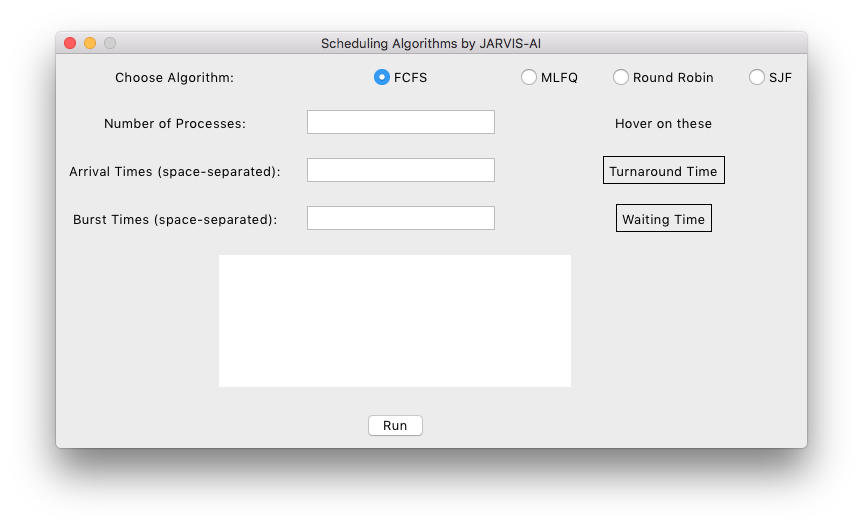
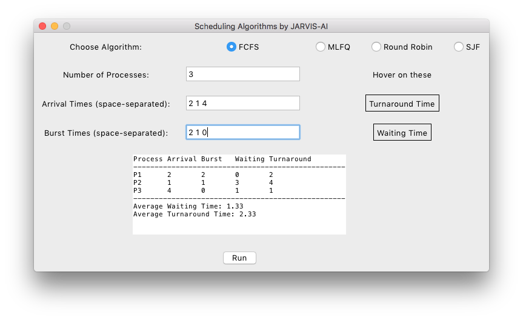
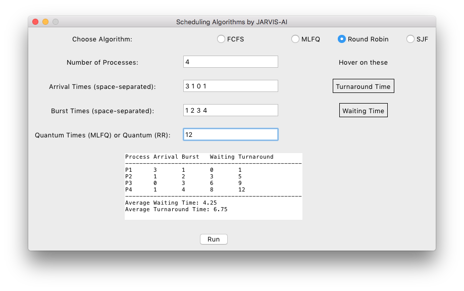
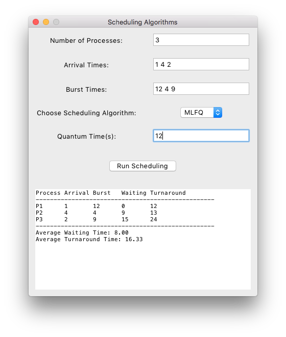

# الگوریتم‌های CPU در Python برای macOS

این پروژه به زبان پایتون نوشته شده است و می‌تواند در هر سیستم‌عاملی اجرا شود.

تنها در macOS تست شده است.

[English Version](README.md)

## نیازمندی‌ها

- پایتون ۳.۱۲+ / pip
- فایل‌های اجرایی TK

### TK

Tkinter به‌صورت پیش‌فرض با توزیع‌های استاندارد پایتون در ویندوز و macOS همراه است و معمولاً نیازی به نصب جداگانه آن نیست. اما، برخی استثنائات و جزئیات مرتبط با هر پلتفرم وجود دارند:

#### ۱. **ویندوز**:
   - Tkinter همراه با پایتون نصب می‌شود و بلافاصله قابل استفاده است.

#### ۲. **macOS**:
   - نسخه رسمی پایتون از [Python.org](https://www.python.org/) شامل Tkinter است.
  

#### ۳. **لینوکس**:
   - در بیشتر توزیع‌های لینوکس، Tkinter به‌طور پیش‌فرض نصب نمی‌شود. ممکن است لازم باشد آن را جداگانه با استفاده از مدیر بسته نصب کنید.

به عنوان مثال:
   - **Debian/Ubuntu**: 
     ```bash
     sudo apt-get install python3-tk
     ```
   - **Fedora**:
     ```bash
     sudo dnf install python3-tkinter
     ```

## تصاویر



<hr />



<hr />



<hr />



## اعتبار

توسعه‌دهنده: امیر محمد صفری

## مجوز

[MIT](LICENSE)
