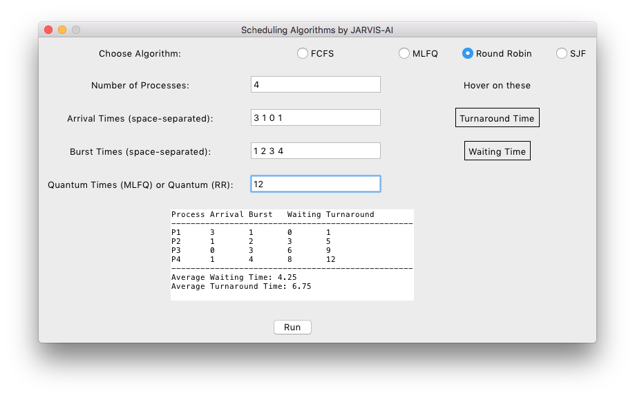

# CPU Algorithm Python macOS

This project written in python and can be run under any OS.

Tested only in macOS.

[توضیحات نسخه فارسی](README-FA.md)

## Requirments

- python 3.12+ / pip
- TK binaries

### TK

Tkinter comes pre-installed with standard Python distributions on Windows and macOS, so you usually don’t need to install it separately. However, here are some exceptions and platform-specific details:

#### 1. **Windows**:
   - Tkinter is bundled with Python, so it’s ready to use out of the box.

#### 2. **macOS**:
   - Python from the official [Python.org](https://www.python.org/) distribution includes Tkinter.
   - If you’re using a system version of Python (pre-installed by macOS), Tkinter may not work correctly. It's often better to install Python from Python.org or use a version from a package manager like Homebrew.

#### 3. **Linux**:
   - On most Linux distributions, Tkinter is not included by default. You may need to install it separately with your package manager.

For example:
   - **Debian/Ubuntu**: 
     ```bash
     sudo apt-get install python3-tk
     ```
   - **Fedora**:
     ```bash
     sudo dnf install python3-tkinter
     ```
## Screenshots


<hr />


<hr />



<hr />


## Credit

Developer: Amir Mohammad Safari

## Lisence

[MIT](LICENSE)
